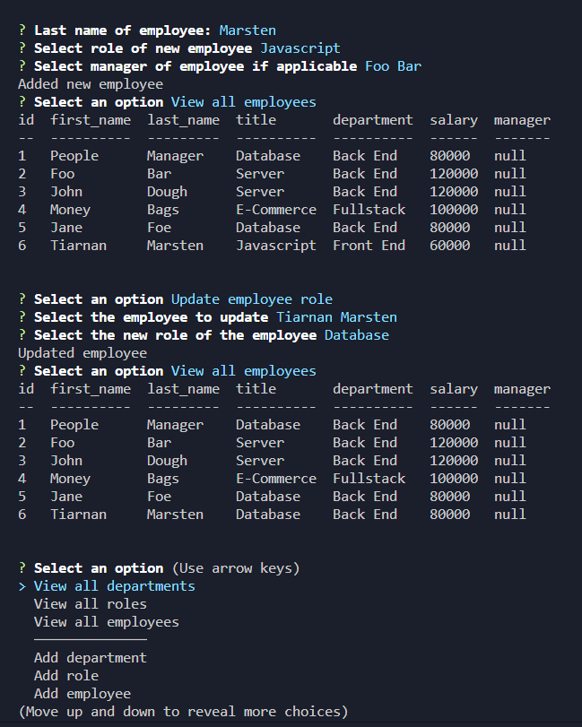

# employee-tracker

## Description

A CLI that manages and tracks employees. This project utilizes `Node.js` and the `inquirer` package to ask the user for input and can display, add, and update employees.

## Installation

Use the command `npm i` to install the required packages.

## Usage

Use the command `node routes/server.js` or `node server.js` when in the routes folder to run the program. After running the commands, the user will be prompted with questions in the terminal.

A demo of the program in use can be found [here]().

## Contribution

Tiarnan Marsten

## License

